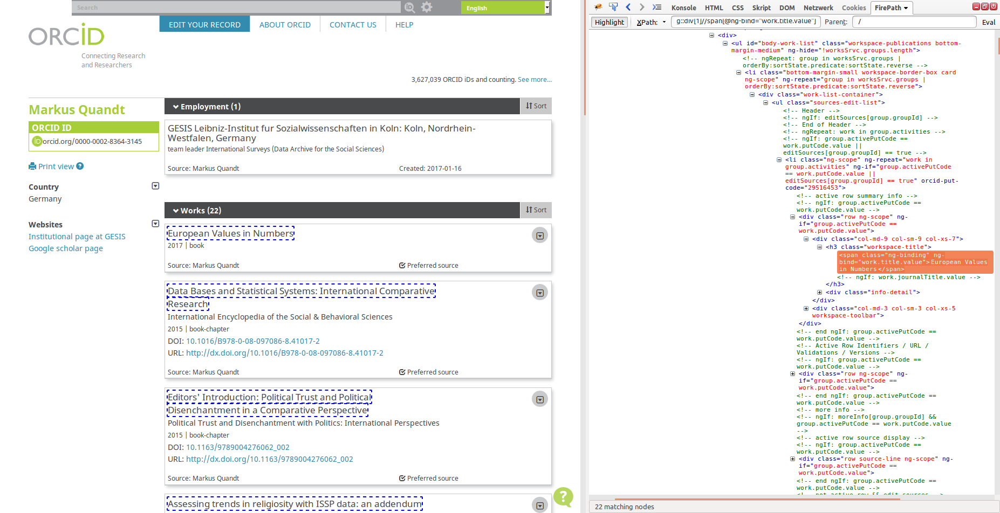
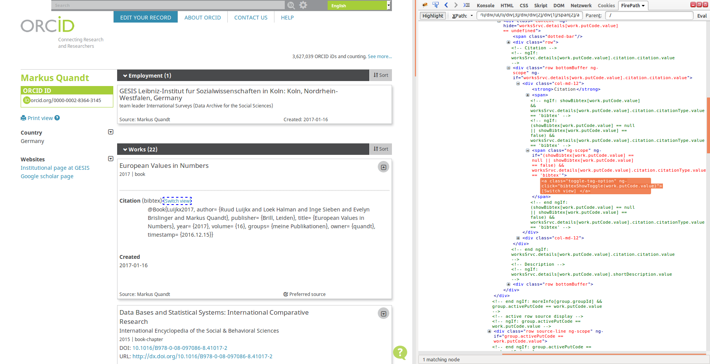
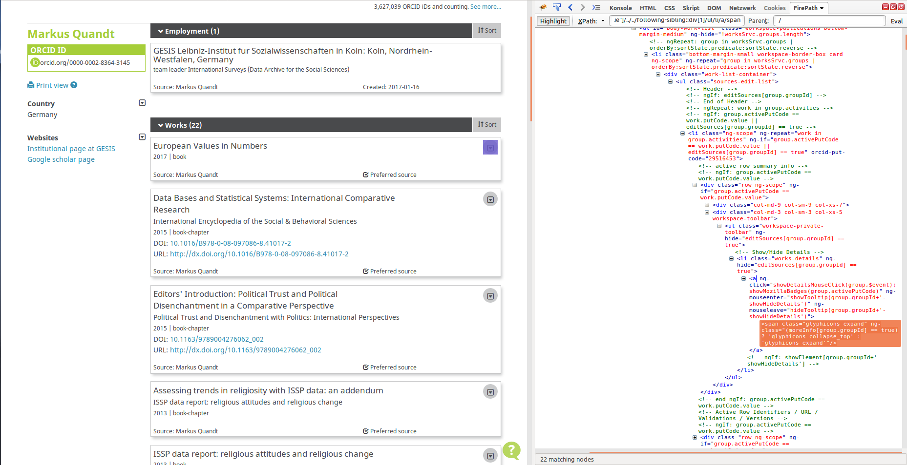

# ORCID wrappers

## orcid.oxt

**Goal:** extract from an authors ORCID profile:
*   name
*   publications
    *   title
    *   source
    *   year
    *   type
    *   doi
    *   citation

**Peculiarities:**
1. Each entry in the "works" section of an authors profile has some information that is at first hidden and only revealed if you click a small button on the right. This is pure javascript. To be able to extract the correct info after clicking the button (which does not result in a major page change), a rather complex navigation through the DOM tree had to be realized. In this case, a lot of `following` navigations were used which makes the evaluation rather slow.
2. The markup of this website makes it rather hard to be sure to extract the right information.
3. In the detailed view, there is another link "switch view" which again triggers a javascript action and replaces the content in case there are several citations available (e.g. APA style and BibTeX). This link is also clicked in this version of the script.

**Note:** this script doesn't seem to work as intended (?)

## orcid_simple.oxt

**Goal:** extract from an authors' ORCID profile:
*   name
*   publications
    *   title
    *   source
    *   year
    *   type
    *   doi

**Peculiarities:** Each entry in the "works" section of an authors profile has some information that is at first hidden and only revealed if you click a small button on the right. This is pure javascript. As it was not trivial to realize this click action and the following extraction of the now-appearing additional content, this version of the script omits this step. See below for details.

# orcid_click.oxt

ORCID Example with click

**Goal:** extract from an authors' ORCID profile:
*   name
*   publications
    *   title
    *   source
    *   year
    *   type
    *   doi
    *   info (=citation information)

**Peculiarities:**
1. Each entry in the "works" section of an authors profile has some information that is at first hidden and only revealed if you click a small button on the right. This is pure javascript. To be able to extract the correct info after clicking the button (which does not result in a major page change), a rather complex navigation through the DOM tree had to be realized.
2. The markup of this website makes it rather hard to be sure to extract the right information.

