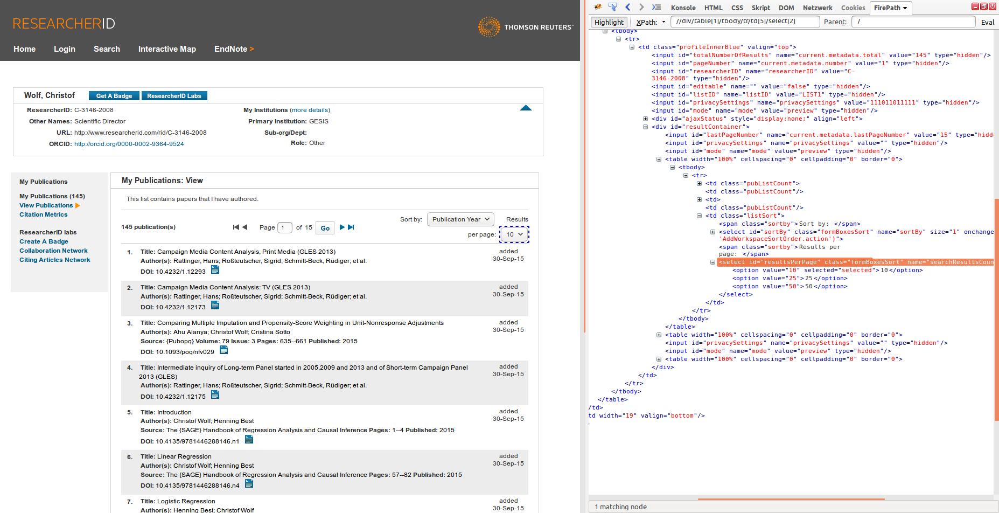
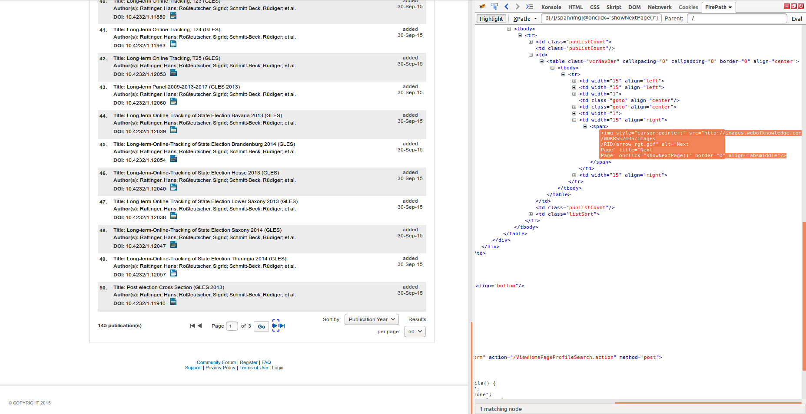
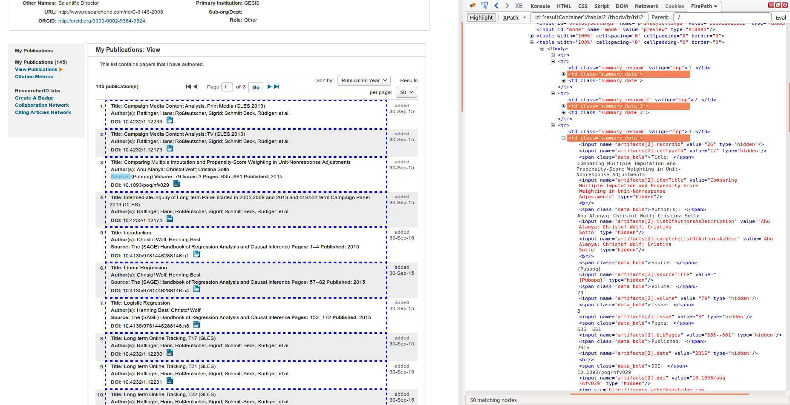

# ResearcherID wrapper

## researcherid.oxt

**Goal:** extract from the publications section of an author's profile on Thomson Reuters ResearcherID:
*   name
*   publications
    *   title
    *   auSuPaPu
    *   doi

**Peculiarities:** the usage of several nested functions to extract a specific part of the text delimited by some other text (`concat` + `substring-before` + `substring-after`)

**Note:** This web page is not very well suited for structured extraction. We had to resort to storing a lot of different information in a single tag (hence the name 'auSuPaPu' which stands for 'authors, source, pages, published') since this information is not at all structurally distinguished in the site's DOM tree. Dividing this information is the responsibility of some post-processing routine.

