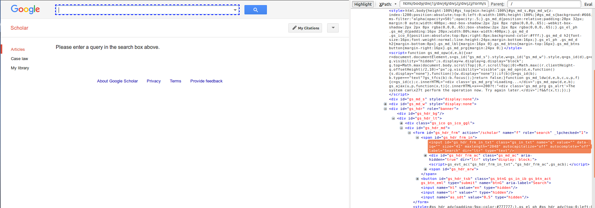
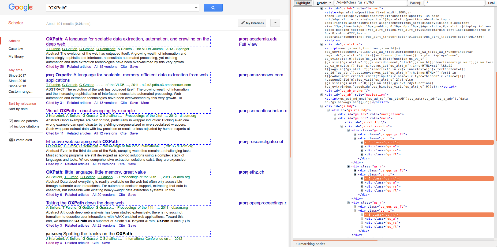
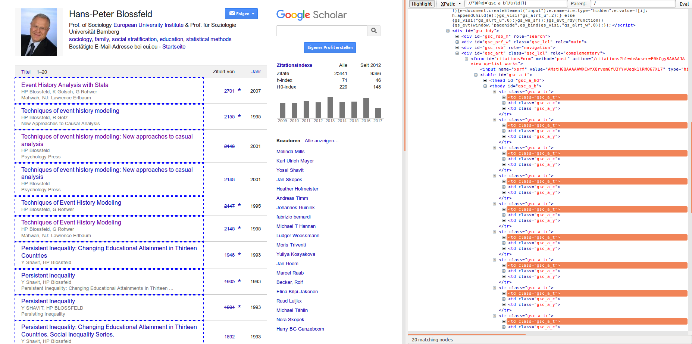
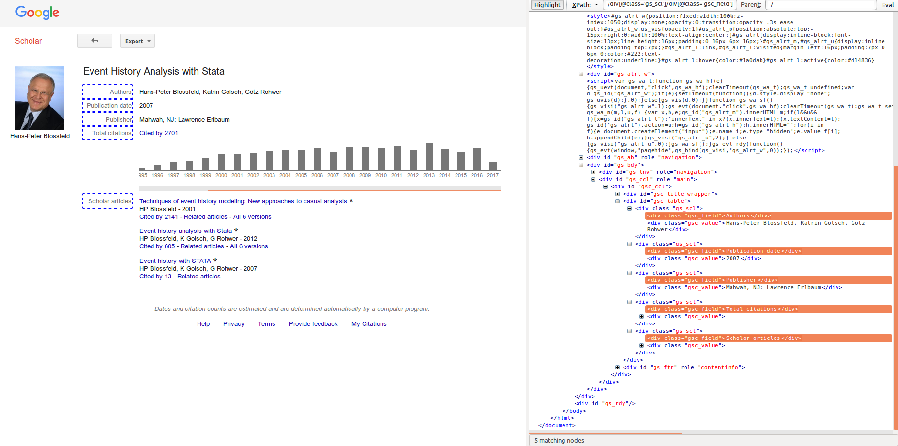

# Google Scholar Wrappers

### scholar.oxp

This wrapper demonstrates how to extract data from the results of a Google Scholar search.
The search term is entered in the query box and submitted by clicking the button next to the box.
Then, the filter for publication year is activated by clicking on the respective link.
With a Kleene star expression, looping over the result pages is performed by continually clicking on the "next page" button.
The title of each result is extracted.

<!--**Goal:** type a query in the search box, and for each result, extract:
*   title
*   authors
*   cited_by
    *   title
    *   authors

**Note:** we plan to use a variant of this expression for getting citation numbers off Google scholar for specific publications.

**Peculiarities:** ?-->

## scholar_short.oxp

Only extracts title and authors for each search result, without narrowing down the result list. Iterates over result pages.

## scholar2.oxp

More extensive script to extract more data. For each result record, the 'cited by' link is clicked and metadata on the citing articles (title, authors) are also extracted.

## scholar.oxt

Like `scholar2.oxp`, but with a variable for the query term.

# scholar_author.oxp

**Goal:** extract from the Google scholar profile of a specific author:
*   name
*   publications
    *   title
    *   authors
    *   date
    *   source
        *   type
        *   title
        *   volume
        *   issue
        *   pages
        *   publisher

**Peculiarities:** The details page has a table structure with varying content, where the first column specifies the type of information that is present in the second column. The expression therefore includes checks for the presence of specific keywords by the use of predicates, to make sure that the correct information is extracted.

