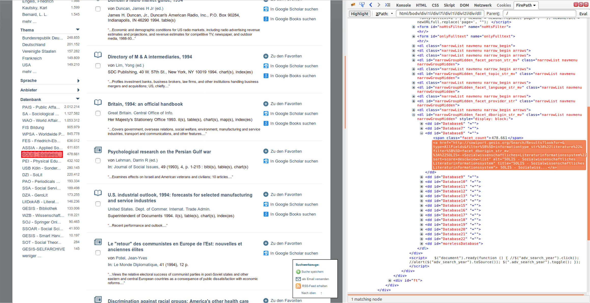

# Sowiport Wrapper

:warning: This wrapper does not work anymore since the Sowiport platform has been shut down.
We provide some screenshots to show how the platform looked like and how the wrapper worked.

---

**Goal**:
extract from all documents contained in the SOLIS database of sowiport:

* title
* editor
* id

**Note:** This script has been used in a short paper for CLEF conference for demonstration purposes.

**Peculiarities:**

1. To get the list of all documents, on the start page of sowiport, the search button has to be clicked without entering a search term first.
2. To narrow down the list of all documents to those from the SOLIS database, the facets have to be used. In the interface, the entry "SOLIS" is in fact hidden from the view, but it can still be located in the DOM tree because the element is just not visible, but present. We can thus address it with an XPath expression. The `WebDriverWrapperFactory` complains with "cannot click on not visible element <a>. Fall back to javascript action", but it works nonetheless.
3. Desired data has to be extracted from the details page which is made up of a table structure where the entries in the first column donate the type of data contained in the second column. Thus we decided to work with `preceding-sibling` axis.
